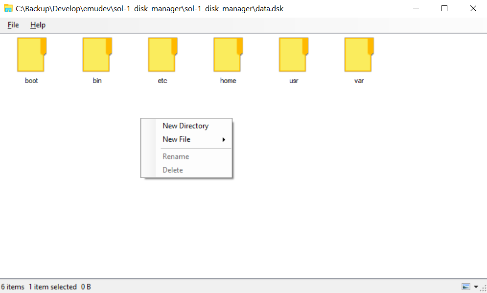
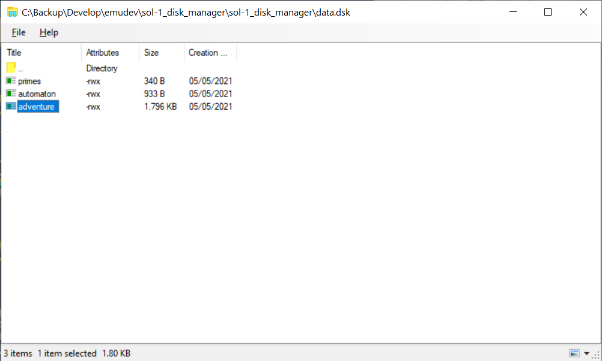
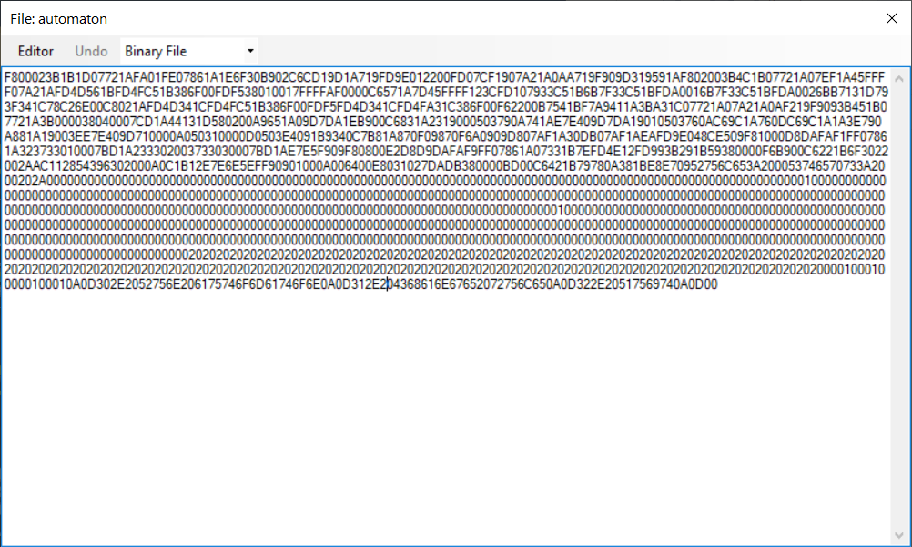

# Baffa-1 Disk Manager for Baffa-1 HomebrewCPU Minicomputer Emulator 

This is a disk manager for Baffa-1 HomebrewCPU Minicomputer - a CPU and Minicomputer made from 74-Series Logic and based on Sol-1 Architecture proposed by Paulo de Tarco Constantino Junior (http://sol-1.org).

I've written an emulator for software testing that is running at http://baffa-1.baffasoft.com.br.

The emulator software is available at https://github.com/abaffa/baffa-1_emulator.

File example.dsk is an example of disk image.

-----BEGIN LICENSE NOTICE----- 

Baffa-1 Disk Manager for Baffa-1 HomebrewCPU Minicomputer System

Copyright (C) 2021  Augusto Baffa, (baffa-1.baffasoft.com.br)

This program is free software; you can redistribute it and/or
modify it under the terms of the GNU General Public License
as published by the Free Software Foundation; either version 2
of the License, or (at your option) any later version.

This program is distributed in the hope that it will be useful,
but WITHOUT ANY WARRANTY; without even the implied warranty of
MERCHANTABILITY or FITNESS FOR A PARTICULAR PURPOSE.  See the
GNU General Public License for more details.

You should have received a copy of the GNU General Public License
along with this program; if not, write to the Free Software
Foundation, Inc., 51 Franklin Street, Fifth Floor, Boston, MA  02110-1301, USA.

-----END LICENSE NOTICE----- 
